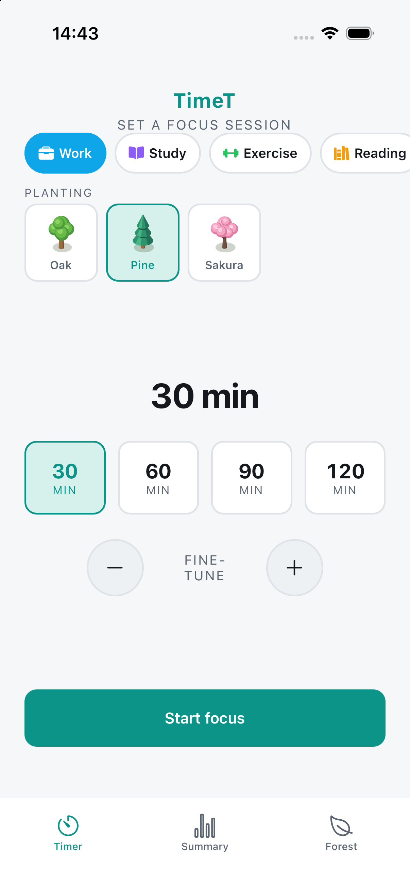
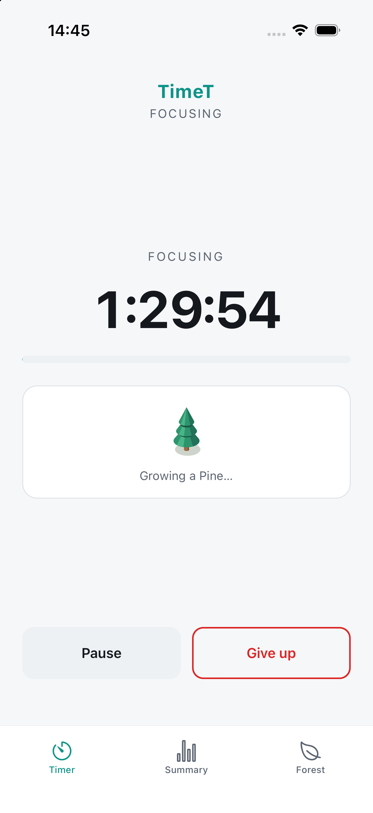
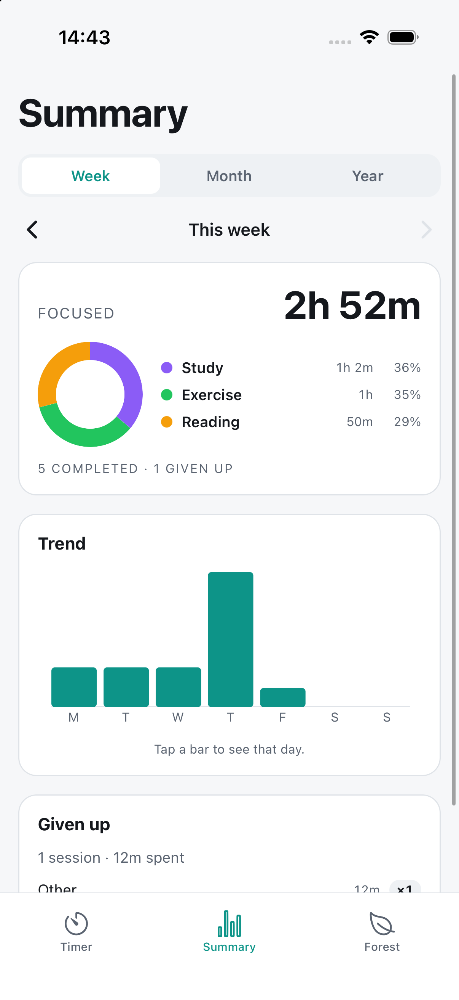
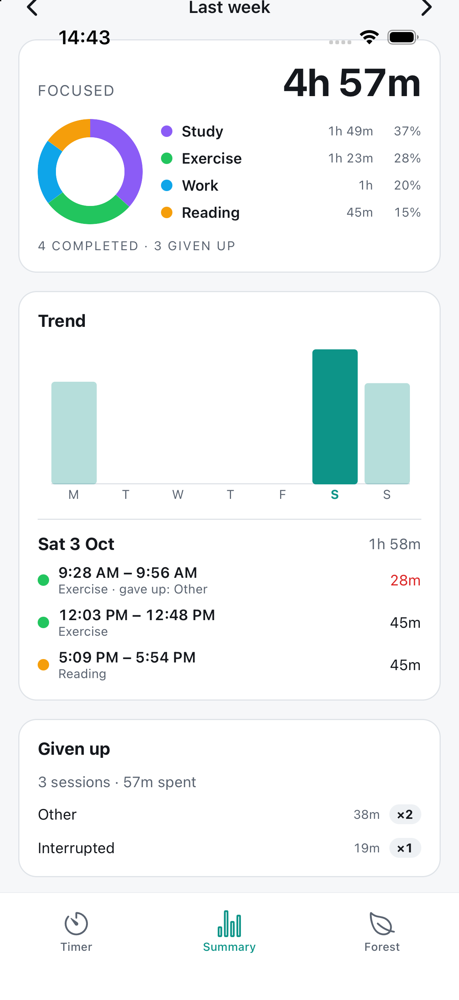
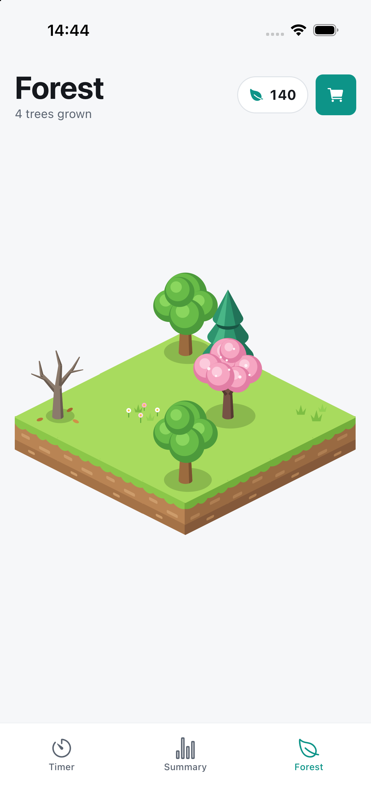
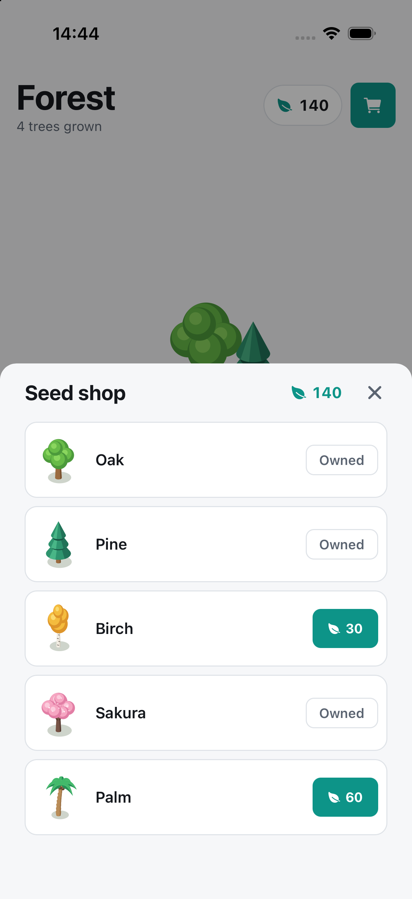
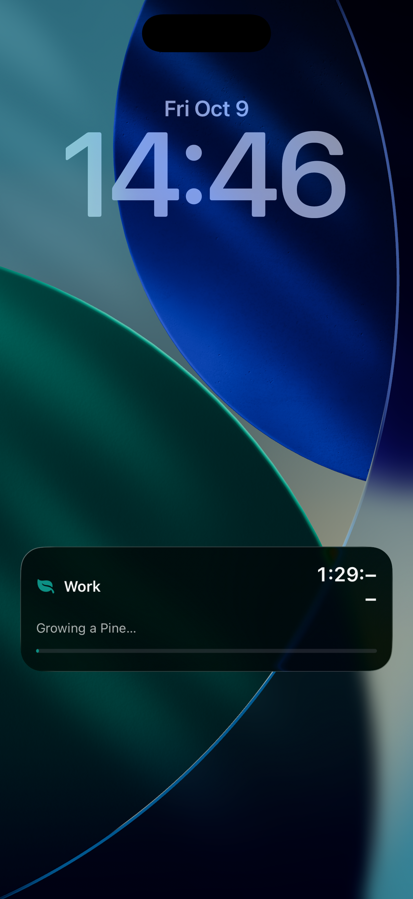

<p align="center">
  
</p>

# TimeT

A Forest-inspired, Pomodoro-style focus timer with a tiny isometric tree-planting game.

> **iOS only.** Android has no implementation at all right now — not a missing feature, just not
> built. Everything below assumes an iPhone and a Mac.

## Why this exists

Every focus-timer-with-a-garden app on the App Store wants a subscription for basics like tags,
stats, or more than one tree type — and the ones that don't are full of ads. This is the simple,
free version of that idea: start a timer, focus, grow a forest. No account, no subscription, no
ads, no network calls — everything lives in a SQLite database on your phone.

## Screenshots
### Timer



### Summary
 
 

### Forest
 
 


### Live activity


## Features

- **Timer** — presets (30/60/90/120 min) plus a ±5-minute stepper, pause/resume, and a give-up flow
  that asks why and still records the time you actually focused.
- **Tags** — custom categories with a color and icon, so sessions can be sorted by what they were for.
- **Forest game** — pick a tree before each session; finishing plants it on your island and earns
  seeds, giving up plants a withered one. Seeds unlock new tree types in a shop; decorations and a
  bigger island show up as you go.
- **Summary** — Week / Month / Year totals, a per-tag donut chart, a trend bar chart, and tapping any
  day drills into its individual sessions.
- **Notifications** — a local "focus complete" alert when a session finishes.
- **Live Activity** — a live countdown on the Lock Screen and in the Dynamic Island while a session
  runs (see screenshots above).
- Everything is on-device. No account, no backend, no tracking.

## Tech stack

Expo SDK 58 + React Native + TypeScript + `expo-router`, state via Zustand, storage via
`expo-sqlite`, charts as hand-rolled SVG, and the Live Activity built on the official `expo-widgets`
module. iOS only — see the note at the top.

## Running it yourself

```bash
npm install
npm start            # press i for iOS simulator, or scan the QR with Expo Go
```

`npm run web` also works for a quick UI preview, but the browser can't run `expo-sqlite`, so it
falls back to an in-memory store (data resets on reload). Notifications and the Live Activity need a
real device build — neither works in Expo Go or the simulator.

### Installing on your iPhone (Mac, free Apple ID)

**You'll need:** a Mac with [Xcode](https://apps.apple.com/app/xcode/id497799835) installed (open
it once after installing so it finishes its own setup), [Node.js](https://nodejs.org/), and any
Apple ID signed into **Xcode → Settings → Accounts** — a free one is enough, no paid Developer
Program required. A free account's signing cert expires after 7 days (see below); a paid one
($99/year) wouldn't need renewing and would also unlock TestFlight, but isn't required for any of
this.

**Before the first build:** change `expo.ios.bundleIdentifier` in `app.json` from the placeholder
`com.example.timet` to something unique to you (e.g. `com.yourname.timet`). It's the only
project-specific value in the whole config — everything else (the widget's app-group id, etc.)
derives from it automatically. Changing it later means the next install is a *new* app rather than
an update, so pick it once and leave it.

**One-time setup:**

```bash
npm install
npx expo prebuild -p ios        # generates the native ios/ project
open ios/TimeT.xcworkspace
```

In Xcode, select the **TimeT** target → **Signing & Capabilities** → tick **Automatically manage
signing** → set **Team** to your Apple ID. Do the same for the **ExpoWidgetsTarget** target (the
Live Activity's widget extension) — both need it or the build fails to sign.

**Install onto the phone:** plug it in via cable and unlock it (tap **Trust** if it asks), then:

```bash
npx expo run:ios --device --configuration Release
```

This builds a standalone Release app — no dev server needed afterwards. First launch needs one more
trust step: Settings → General → **VPN & Device Management** → trust your developer certificate.

A free Apple ID's signing certificate expires after **7 days** — after that the app won't launch
until you rebuild. Run `./renew.sh` to do that (it finds your connected phone and reinstalls
automatically). Reinstalling is just an app update: your sessions, tags, and forest progress aren't
affected.

## Project layout

```
src/
  app/              expo-router screens (tabs)
    _layout.tsx       tab navigator
    index.tsx         Timer screen
    summary.tsx       Summary / stats screen
    forest.tsx        Isometric Forest game (island, seeds, shop)
  components/
    DurationPicker.tsx  presets + stepper duration selector
    TimerProgress.tsx   running countdown + thin progress bar
    TagSelector.tsx     category chips on the Timer screen
    TagEditorModal.tsx  create / edit / delete tags
    GiveUpModal.tsx     reason prompt when abandoning a session
    charts/             SVG DonutChart + BarChart (no chart library)
    forest/             IsoForest renderer, TreeThumb, TreeSelector, ForestShopModal
  db/                 expo-sqlite layer: schema + migrations + seed
    index.ts            open db, create tables, seed default tags
    tags.ts             tag queries (CRUD)
    sessions.ts         session queries (insert, by range)
    settings.ts         key/value settings (e.g. selected tag)
    types.ts            Tag / SessionRecord types + id helper
  features/
    timer/timerStore.ts      Zustand timer state machine (timestamp-based)
    tags/tagStore.ts         Zustand tag store (loads from db, CRUD, selection)
    tags/options.ts          color + icon choices for the tag editor
    summary/dateRange.ts     week/month/year ranges + trend buckets
    summary/aggregate.ts     rolls sessions into totals, per-tag, trend, abandoned
    notifications/           schedule/cancel the "session complete" notification
    liveActivity/            Lock Screen / Dynamic Island widget UI + start/pause/resume/end
    forest/sprites.ts        iso sprite pack (trees/ground/decor as SVG strings)
    forest/forestConfig.ts   tree types, costs, tile helpers
    forest/forestStore.ts    Zustand forest store (seeds/trees/island, persisted)
  theme/              design tokens + useAppTheme
  lib/                helpers (time formatting)
```
